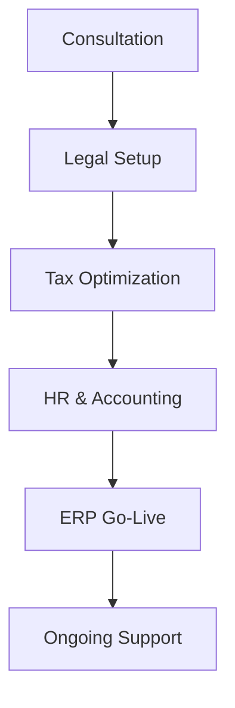

## Overview

Jay Hanson provides comprehensive business consulting services to help you expand into Eastern Europe, Central Asia, and the Caucasus. With expertise across legal, tax, accounting, HR, and ERP domains, you receive end-to-end support from 18 offices in 15 countries. Since 2003, over 500 professionals have assisted companies in establishing subsidiaries, optimizing operations, and reducing costs while mitigating regional risks.

<Callout kind="info">
  Jay Hanson acts as your one-stop partner, handling everything from initial setup to ongoing compliance.
</Callout>

## Key Services

Discover the core offerings designed for international growth. Each service integrates seamlessly to streamline your expansion.

<Columns cols={3}>
  <Card title="Legal & Subsidiary Establishment" icon="scale" href="#legal">
    Set up branches and subsidiaries compliant with local laws. Handle registrations, contracts, and governance structures efficiently.
  </Card>
  <Card title="Tax Compliance & Optimization" icon="percent" href="#tax">
    Navigate complex tax regimes with strategies to minimize liabilities and ensure full compliance across jurisdictions.
  </Card>
  <Card title="Accounting & Financial Reporting" icon="bar-chart-3" href="#accounting">
    Maintain accurate books, prepare reports, and optimize financial processes tailored to multinational operations.
  </Card>
  <Card title="HR Recruitment & Management" icon="users" href="#hr">
    Build and manage teams with local expertise in hiring, payroll, and compliance for cross-border workforces.
  </Card>
  <Card title="ERP Integration & Customization" icon="database" href="#erp">
    Implement and customize ERP systems like SAP or Oracle to unify your operations regionally.
  </Card>
</Columns>

## Implementation Process

Follow these steps to engage Jay Hanson's services and accelerate your expansion.

<Steps>
  <Step title="Initial Consultation" icon="phone">
    Contact Jay Hanson to discuss your expansion goals. Share details on target countries and timelines.

    ```
    Email: contact@jayhanson.com
    Subject: Expansion Consultation - [Your Company]
    ```
  </Step>
  <Step title="Needs Assessment" icon="search">
    Receive a customized audit of legal, tax, and operational requirements.
  </Step>
  <Step title="Service Selection" icon="check-circle">
    Choose from bundled or individual services. Sign agreements with clear milestones.
  </Step>
  <Step title="Execution & Support" icon="rocket">
    Benefit from dedicated teams for setup, ongoing management, and 24/7 support.
  </Step>
</Steps>

## Service Details by Region

Tailor services to your target region using these focused approaches.

<Tabs>
  <Tab title="Eastern Europe" icon="map-pin">
    Prioritize EU-aligned legal setups and VAT optimization.

    | Service | Key Focus | Timeline |
    |---------|-----------|----------|
    | Legal | Branch registration | 4-6 weeks |
    | Tax | Transfer pricing | Ongoing |
    | HR | Work permits | 2-4 weeks |
  </Tab>
  <Tab title="Central Asia" icon="globe">
    Emphasize customs compliance and local partnerships.

    | Service | Key Focus | Timeline |
    |---------|-----------|----------|
    | ERP | SAP localization | 8-12 weeks |
    | Accounting | IFRS reporting | Monthly |
    | Tax | Withholding taxes | Quarterly |
  </Tab>
  <Tab title="Caucasus" icon="shield">
    Focus on geopolitical risk mitigation and rapid setup.

    | Service | Key Focus | Timeline |
    |---------|-----------|----------|
    | Legal | JV agreements | 3-5 weeks |
    | HR | Expat relocation | Immediate |
    | ERP | Oracle integration | 6-10 weeks |
  </Tab>
</Tabs>

## Advanced Customization

<Expandable title="ERP Customization Example" default-open="false">

Customize your ERP with Jay Hanson's integration services. Here's a sample configuration for multi-entity reporting:

````json
{
  "entities": [
    {
      "country": "Poland",
      "legalEntity": "JayHanson_PL_Sp_z_oo",
      "taxId": "PL1234567890",
      "erpModule": "SAP S/4HANA"
    },
    {
      "country": "Kazakhstan",
      "legalEntity": "JayHanson_KZ_LLP",
      "taxId": "KZ123456789012",
      "erpModule": "Oracle Cloud"
    }
  ],
  "reporting": {
    "consolidated": true,
    "currency": "EUR",
    "frequency": "monthly"
  }
}
````

</Expandable>

## Best Practices

Leverage Jay Hanson's expertise to avoid common pitfalls.

<Callout kind="tip">
  Start with a bundled service package for cost savings up to 30% on initial setup.
</Callout>

Integrate services early in your planning phase. Regularly review tax strategies quarterly to adapt to regulatory changes. Use ERP dashboards for real-time visibility into regional performance.



This holistic approach ensures scalable growth while minimizing risks. Contact Jay Hanson today to begin.