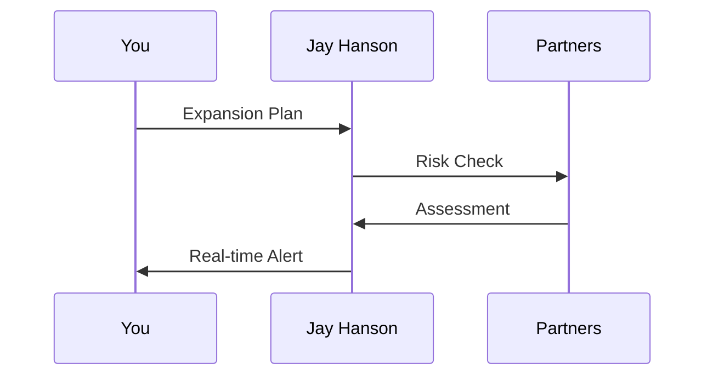

## Overview

Jay Hanson connects seamlessly with your existing tools and local ecosystems. You gain access to ERP systems, compliance platforms, and partner networks across 15 countries. These integrations automate workflows, ensure regulatory adherence, and provide real-time insights to reduce risks during market expansion.

<Columns cols={3}>
  <Card title="ERP Connections" icon="database" href="#erp-integrations">
    Sync data with SAP, Oracle, and local systems for unified operations.
  </Card>
  <Card title="Compliance Tools" icon="shield" href="#compliance">
    Automate filings and audits with integrated regulatory APIs.
  </Card>
  <Card title="Partner Networks" icon="users" href="#partners">
    Collaborate with 500+ experts in Eastern Europe and Central Asia.
  </Card>
</Columns>

## ERP and Software Integrations

Connect Jay Hanson to your ERP and accounting software for automated data flow. You handle payroll, invoicing, and inventory without manual entry.

<Tabs>
  <Tab title="SAP" icon="package">
    Use Jay Hanson's SAP connector to push subsidiary data.

    <CodeGroup tabs="JavaScript,Python">
      ```javascript
      const sapData = {
        subsidiaryId: 'sub-12345',
        payroll: 150000,
        currency: 'EUR'
      };

      await fetch('https://api.example.com/v1/erp/sap', {
        method: 'POST',
        headers: { 'Authorization': `Bearer ${YOUR_TOKEN}` },
        body: JSON.stringify(sapData)
      });
      ```
      ```python
      import requests

      sap_data = {
          'subsidiary_id': 'sub-12345',
          'payroll': 150000,
          'currency': 'EUR'
      }

      response = requests.post(
          'https://api.example.com/v1/erp/sap',
          json=sap_data,
          headers={'Authorization': f'Bearer {YOUR_TOKEN}'}
      )
      ```
    </CodeGroup>
  </Tab>
  <Tab title="Oracle NetSuite" icon="cloud">
    Pull financial reports directly into your Jay Hanson dashboard.

    ```javascript highlight="3-5" show-lines={true}
    const netsuiteQuery = {
      reportType: 'financials',
      period: 'Q3-2024',
      region: 'kazakhstan'
    };

    const response = await fetch('https://api.example.com/v1/erp/netsuite', {
      method: 'POST',
      body: JSON.stringify(netsuiteQuery)
    });
    ```
  </Tab>
</Tabs>

## Local Regulatory Compliance

Jay Hanson integrates with government APIs in 15 countries. You stay compliant with tax filings, labor laws, and reporting requirements automatically.

<Callout kind="alert">
  Always verify local data privacy laws before enabling compliance integrations.
</Callout>

<ParamField path="country" param-type="string" required="true">
  ISO country code (e.g., `KZ` for Kazakhstan).
</ParamField>

<ParamField header="Authorization" param-type="string" required="true">
  Bearer token from Jay Hanson dashboard.
</ParamField>

## Partner Networks Setup

Access Schneider Group's network of 500+ experts. Follow these steps to onboard partners for your expansion.

<Steps>
  <Step title="Request Access" icon="users">
    Log in to your dashboard at `https://dashboard.example.com` and navigate to Partners.
  </Step>
  <Step title="Select Region" icon="map">
    Choose from 15 countries like Poland, Georgia, or Uzbekistan.
  </Step>
  <Step title="Connect Tools" icon="link">
    Enable shared access for HR and legal collaboration.

````bash
curl -X POST https://api.example.com/v1/partners/onboard \
  -H "Authorization: Bearer YOUR_TOKEN" \
  -d '{"region": "caucasus", "services": ["hr", "tax"]}'
````

  </Step>
</Steps>

## Risk Mitigation Tools

Collaborate via integrated platforms like Slack or Microsoft Teams. Jay Hanson sends alerts on compliance risks and cost overruns.



## Webhooks for Real-Time Updates

Set up webhooks to receive instant notifications on subsidiary status, tax changes, or partner updates.

<Request tabs="JavaScript,cURL" show-lines="true">
  ```javascript
  // Register webhook endpoint
  await fetch('https://api.example.com/v1/webhooks', {
    method: 'POST',
    headers: { 'Authorization': `Bearer ${YOUR_TOKEN}` },
    body: JSON.stringify({
      url: 'https://your-webhook-url.com/jayhanson',
      events: ['subsidiary.approved', 'tax.update']
    })
  });
  ```
  ```bash
  curl -X POST https://api.example.com/v1/webhooks \
    -H "Authorization: Bearer YOUR_TOKEN" \
    -H "Content-Type: application/json" \
    -d '{
      "url": "https://your-webhook-url.com/jayhanson",
      "events": ["subsidiary.approved", "tax.update"]
    }'
  ```
</Request>

<Response tabs="200,400">
  ```json
  {
    "id": "wh_789abc",
    "url": "https://your-webhook-url.com/jayhanson",
    "status": "active",
    "events": ["subsidiary.approved", "tax.update"]
  }
  ```

  ```json
  {
    "error": "Invalid URL format",
    "code": "INVALID_WEBHOOK_URL"
  }
  ```
</Response>

<Callout kind="tip">
  Test webhooks in sandbox mode first. Use ngrok for local development.
</Callout>

These integrations position Jay Hanson as your central hub for Eastern European expansion, saving time and reducing errors across operations.