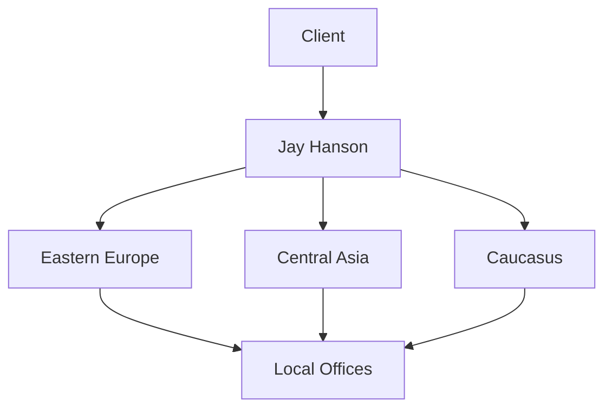

## Overview

Jay Hanson delivers comprehensive business consulting from Schneider Group, your one-stop partner for legal, tax, accounting, HR, and ERP solutions. You gain expertise tailored for businesses expanding into or operating within Eastern Europe, Central Asia, and the Caucasus. Since 2003, Schneider Group has supported companies with over 500 employees across 18 offices in 15 countries, helping you establish branches, optimize processes, mitigate risks, and reduce costs.

## Key Services

Schneider Group offers end-to-end support through Jay Hanson. Explore core services below.

<Tabs>
  <Tab title="Legal" icon="shield">
    Handle company formation, contracts, and compliance for subsidiaries and branches.
  </Tab>
  <Tab title="Tax" icon="file-text">
    Optimize tax structures, manage filings, and ensure transfer pricing compliance.
  </Tab>
  <Tab title="Accounting" icon="calculator">
    Maintain books, prepare financial statements, and support audits.
  </Tab>
  <Tab title="HR" icon="users">
    Recruit staff, manage payroll, and navigate local labor laws.
  </Tab>
  <Tab title="ERP" icon="database">
    Implement and customize ERP systems like SAP or 1C for regional operations.
  </Tab>
</Tabs>

<Callout kind="tip">
  Jay Hanson integrates all services, saving you time and coordination efforts.
</Callout>

## Expertise Areas and Benefits

Leverage Schneider Group's deep regional knowledge to accelerate your expansion.

<Columns cols={3}>
  <Card title="Risk Mitigation" icon="alert-triangle" href="#global-presence">
    Navigate complex regulations and geopolitical challenges with proven strategies.
  </Card>
  <Card title="Cost Optimization" icon="trending-down">
    Reduce operational expenses through efficient structures and local insights.
  </Card>
  <Card title="Process Streamlining" icon="settings">
    Implement scalable ERP and HR systems tailored to your business needs.
  </Card>
</Columns>

Businesses choose Jay Hanson for faster market entry, lower compliance risks, and sustainable growth. You benefit from a single partner handling multi-country setups, cutting down on vendor management.

## Global Presence

<Expandable title="Company History and Offices" default-open="true">
  Founded in 2003, Schneider Group has grown to 500+ employees serving clients across 15 countries. Key offices include Warsaw, Riga, Tallinn, Almaty, Tbilisi, and more.

  | Region          | Offices          | Countries |
  |-----------------|------------------|-----------|
  | Eastern Europe  | Warsaw, Riga     | 5         |
  | Central Asia    | Almaty, Tashkent | 4         |
  | Caucasus        | Tbilisi, Yerevan | 3         |
  | Others          | 18 total         | 15 total  |
</Expandable>

## Quick Start

Get started with Jay Hanson in three steps.

<Steps>
  <Step title="Assess Needs" icon="search">
    Identify your expansion goals and challenges.
  </Step>
  <Step title="Contact Team" icon="mail">
    Reach out via email at `contact@jayhanson.com` or schedule a call.
  </Step>
  <Step title="Receive Proposal" icon="file-text">
    Review customized services and pricing within 48 hours.
  </Step>
</Steps>

## Next Steps

<Columns cols={2}>
  <Card title="Services Overview" icon="book-open" href="/services">
    Dive into detailed service descriptions.
  </Card>
  <Card title="Case Studies" icon="star" href="/case-studies">
    See real-world success stories.
  </Card>
  <Card title="Contact Us" icon="phone" href="/contact">
    Book a free consultation today.
  </Card>
  <Card title="Resources" icon="download" href="/resources">
    Download guides and checklists.
  </Card>
</Columns>

<Callout kind="success">
  Ready to expand? Start your journey with Jay Hanson now.
</Callout>